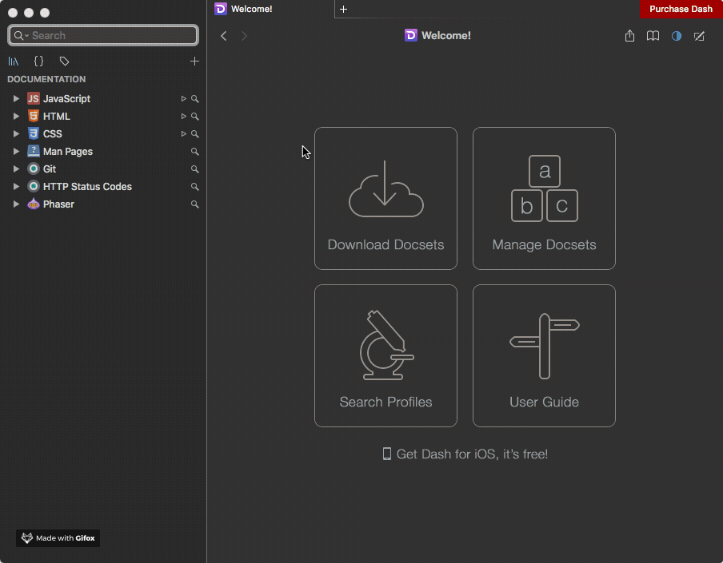

# phaser-docset

This is an unofficial Phaser Dash docset to browse the Phaser documentation offline and in a faster way.



The docset support only the lastest Phaser 3 version.

I'll try to keep the docset in sync with the official [Phaser documentation repo](https://github.com/photonstorm/phaser3-docs).

>I'll probably delete this repo when an official docset for Phaser 3 will be available.

[Download the lastest updated docset](https://github.com/rootasjey/phaser-docset/releases)

## Build

>To build your own Phaser docset follow the instructions.

This docset was generated using [Dashing](https://github.com/technosophos/dashing).

In order to contribute, you'll have to follow the instruction to install Dashing

**REMARK: it seems to be only available for OSX**:

```
brew install dashing
```

Then clone this repo:

```
git clone https://github.com/rootasjey/phaser-docset.git
```

```
cd phaser-docset/
```

Inside the `phaser-docset` folder, clone the official Phaser 3 documentation:

```
git clone https://github.com/photonstorm/phaser3-docs.git
```

Now copy/paste the `dashing.json` file:

* from `phaser-docset/`
* to `phaser-docset/phaser3-docs/docs/`

Then go inside the `phaser-docset/phaser3-docs/docs/` folder where the `HTML`documentation is:

```
cd phaser3-docs/docs/
```

You can now run the command to build the docset

 ```
 dashing build phaser
 ```

Now you can import the new generated docset into Dash.

## Contributing

You can contribute by editing the `dashing.json` file and sending a [pull request](https://github.com/rootasjey/phaser-docset/pulls).

I'll generate the new docset and upload it to the [release page](https://github.com/rootasjey/phaser-docset/releases).

See [Dashing documentation](https://github.com/technosophos/dashing#readme) for more capabilities.

## LICENCE

MIT Licence.
